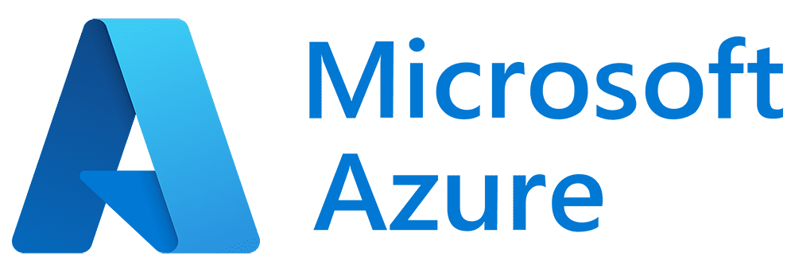
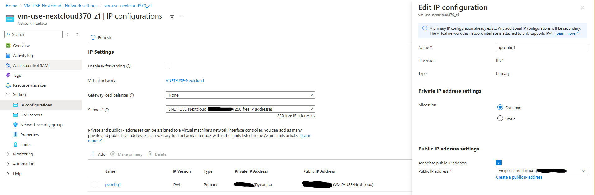
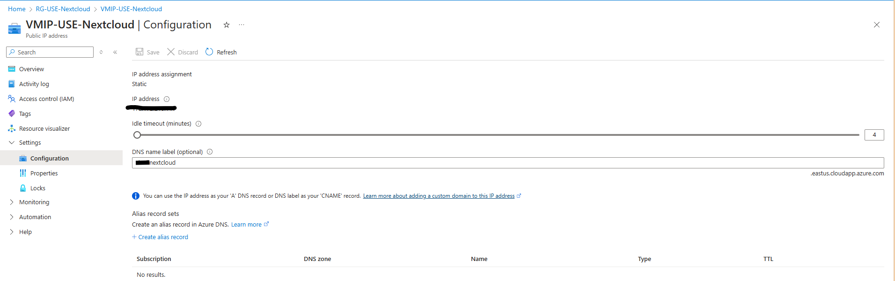

## ☁️ Nextcloud in Azure

This project showcases the deployment of a Nextcloud web server using a Virtual Machine in Microsoft Azure. 

## 📖 Table of Contents
- [Overview](#-overview)
- [Architecture](#️-architecture)
- [Technologies Used](#-technologies-used)
- [Setup & Deployment](#️-demo)
- [Demo](#-setup--deployment)
- [Security Considerations](#-security-considerations)

## 🔍 Overview

I created this project as part of my journey to build practical cloud engineering skills - with a focus on undestanding core concepts in **networking** and **security** within the Azure ecosystem. 

Furthemore, it has been a long-time goal of mine to set up a self-hosted platform where I have full control over my data. I've always been interested in learning how to host and manage my own services rather than relying solely on third-party platforms (e.g., Google Drive, iCloud, OneDrive, etc)

## 🏗️ Architecture

This project uses several core Azure components to build a secure and functional environment for hosting a self-managed Nextcloud server:

* **Resource Group** - A container that holds all resources related to the project.
* **Virtual Machine (VM)** - Hosts the Nextcloud web server.
* **Network Interface Controller (NIC)** - Connects the VM to the subnet and virtual network; exposes the public IP.
* **Virtual Network (VNET)** - Provides a private network environment for the VM.
* **Subnet** - A logical segment of the VNET where the VM is deployed.
* **Network Security Group (NSG)** - Controls inbound and outbound traffic to the subnet and VM using custom rules.
* **Azure Bastion** - Enables secure SSH access to the VM via the Azure portal without exposing it to the public internet.
* **Public IP and DNS Label** - Used to make the Nextcloud server publicly accessible via a custom domain name.

###  **Diagram (Architecture Overview)**

# 🧰 Technologies Used
* **Microsoft Azure** - Cloud platform for deploying and managing infrastructure
* **Nextcloud** - Self-hosted, open-source web server for file storage
* **Ubuntu Linux (22.04)** - OS running on the VM
* **Azure Bastion** - Secure SSH access to the VM
* **Azure Virtual Network (VNET)** - Provides the private network environment
* **Network Security Group (NSG)** - Defining and applying traffic control rules

# 🚀 Setup & Deployment
This project was deployed through the **Azure Portal**, while the Nextcloud server was installed and configured using the command line interface (CLI) directly on the virtual machine.

### Key steps of the project

1. Creating **Resource Group** for all resources related to this project

2. Creating **VNET** and **Subnet** for network isolation inside the resource group

3. Creating **NSG** around the subnet to allow/deny inbound and onbound traffic

4. Deploying **Bastion** to connect to a VM

5. Creating an **Ubuntu Server VM**

6. Connect to VM using **Bastion via SSH**

Once connected to VM, the following CLI commands are required to set up Nextcloud:

* Install Nextcloud packages

``
sudo snap install nextcloud
``

* Set up admin account

``
sudo nextcloud.manual-install admin password
``

* Create self-signed certificate

``
sudo nextcloud.enable-https self-signed
``

7. Create Public IP and allow only HTTPS connections 

8. Create a DNS Label

* The next step is to communicate DNS label to the Nextcloud server. This will require SSH connection to the VM and the following command:

``
sudo nextcloud.occ config:system:set trusted_domains 1 --value=dns_label.eastus.cloudapp.azure.com
``

## 🖼️ Demo
Once the Nextcloud server was fully deployed in Azure, here's a walkthrough of the final result in action:

## 🔐 Security Considerations
This project follows security best practices:
* ✅ **SSH Key Authentication** - Access to the VM was secured using an SSH key pair (``.pem`` file), ensuring a more secure method of authentication.
* ✅ **Access via Azure Bastion** - The VM was accessed through **Azure Bation**, which provides secure, browser-based SSH connectivity without exposing any public SSH ports to the internet.
* ✅ **Network Security Groups (NSG)**: Inbound and outbound traffic was tightly controlled using NSG rules, allowing only necessary communication paths.
* ✅ **Resource Isolation**: The VM and related components were deployed in a dedicated Virtual Network and Subnet.

